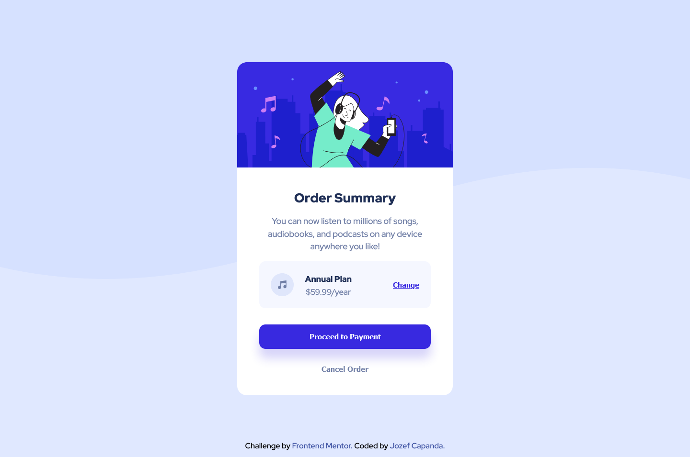

# Frontend Mentor - Order summary card solution

This is a solution to the [Order summary card challenge on Frontend Mentor](https://www.frontendmentor.io/challenges/order-summary-component-QlPmajDUj). Frontend Mentor challenges help you improve your coding skills by building realistic projects.

## Table of contents

- [Overview](#overview)
  - [Screenshot](#screenshot)
  - [Links](#links)
- [My process](#my-process)
  - [Built with](#built-with)
- [Author](#author)

## Overview

### Screenshot

### Links

- Solution URL: [Open in New Tab (Ctrl + click)](https://www.frontendmentor.io/solutions/3column-preview-card-component-using-flexwrap-uIMoeXEBvW)
- Live Site URL: [Open in New Tab (Ctrl + click)](https://jozef-capanda.github.io/Frontend-Mentor-Order-summary-card/)

## My process

### Built with

- Semantic HTML5 markup
- CSS custom properties
- CSS Grid
- Flexbox

## Author

- Frontend Mentor - [@jozef-capanda](https://www.frontendmentor.io/profile/jozef-capanda)
